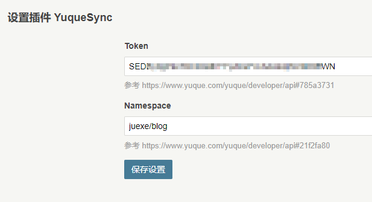
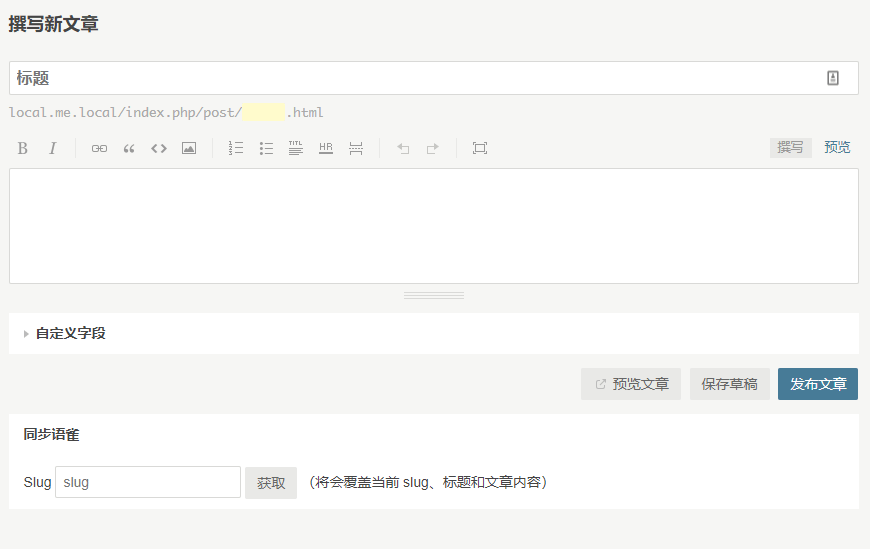

## 要求

这里假设你已经拥有一个基于 [Typecho][6] 的博客。

> Typecho 是一个简洁、轻量、开源的 Markdown 博客程序。 
> [关于 Typecho][7]

## 插件说明

本插件可以在 Typecho 编辑器中直接同步语雀文档内容。

该功能使用语雀官方接口实现，更多说明见 [开发者文档][3]。

> **[语雀][1]** 是一个从阿里蚂蚁金服孵化出来的云端知识库，功能十分[强大且易用][2]。

## 使用方式

### 1 安装插件

将插件源码放置在 `[PathToTypecho]/usr/plugins` 目录下，并在后台启用插件 `YuqueSync` 即可。

### 2 配置

安装并启用插件后，
需要配置 `token` 和 `namespace` 两个参数，具体含义详见 [用户认证][4] 和 [参数说明][5]。

配置界面：

### 3 同步

现在打开编辑文章页面，已经可以看到编辑器底部多了一块 `同步语雀` 的区块，
填写语雀文档 [Slug][5] 即可同步。

效果预览：

（完）

[1]: https://www.yuque.com/yuque/help/about "语雀是什么"
[2]: https://www.yuque.com/yuque/help "语雀用户手册"
[3]: https://www.yuque.com/yuque/developer "语雀开发者文档"
[4]: https://www.yuque.com/yuque/developer/api#785a3731 "语雀开发者文档#用户认证"
[5]: https://www.yuque.com/yuque/developer/api#21f2fa80 "语雀开发者文档#参数说明"
[6]: https://github.com/typecho/typecho	"Typecho 源码"
[7]: http://typecho.org/about "关于 Typecho"